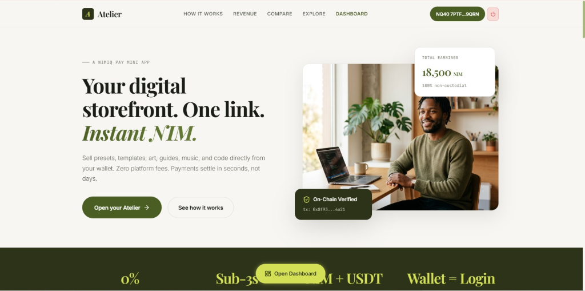
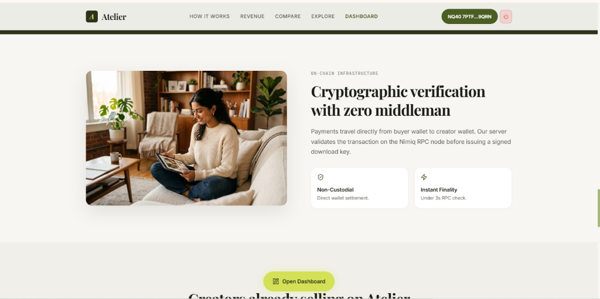
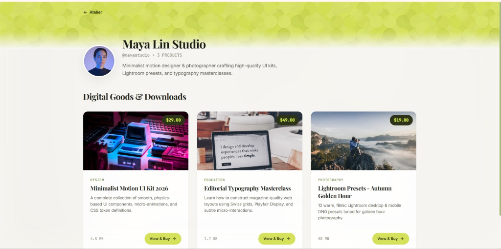
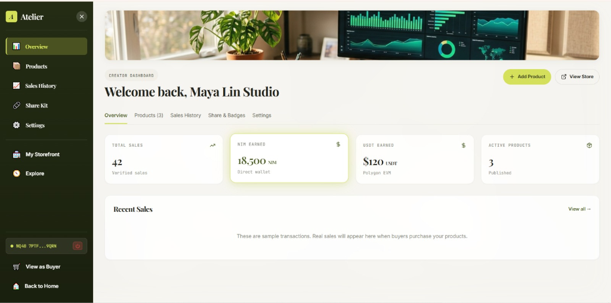
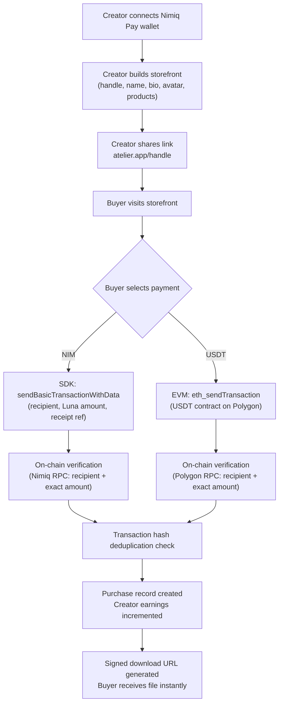

# Atelier

<p align="center">
  <strong>Your digital storefront. One link. Instant NIM.</strong>
</p>

<p align="center">
  
  
  
  
</p>

<p align="center">
  
</p>


> **Atelier is a zero-commission creator storefront that lives inside Nimiq Pay.**
> 
> Photographers sell presets. Designers sell templates. Musicians sell sample packs. Developers sell boilerplates. Every payment settles in under three seconds, verified on-chain, with the creator keeping 100% of the revenue. No accounts. No middlemen. No platform fees.

**Gumroad takes 10%. Payhip takes 5%. Atelier takes nothing.**

---

## Product Screenshots

| Landing Page | Creator Storefront |
|:---:|:---:|
|  |  |
| **Creator Dashboard** | **Product Checkout** |
|  |  |

---

## Live Links

| Resource | Link |
|---|---|
| **Live App** | [atelier-fawn-seven-53.vercel.app](https://atelier-fawn-seven-53.vercel.app) |
| **GitHub** | [github.com/0xkinno/atelier](https://github.com/0xkinno/atelier) |
| **Demo Video** | [Watch on YouTube](https://youtu.be/ugT1-2piNLY?si=9UaadsKQzxxgUail) |
| **Competition** | Nimiq Mini Apps Competition, Cycle I |

---

## The problem

Digital creators lose money every time they sell their work.

A photographer uploads a Lightroom preset pack to Gumroad. The platform takes a 10% cut. Stripe takes another 2.9% plus 30 cents. The payout arrives seven to fourteen days later. After fees and delays, the photographer keeps roughly 87 cents of every dollar a customer paid.

This fee structure exists because traditional payment rails require intermediaries. A credit card transaction passes through the merchant's bank, the card network, the issuing bank, and the platform itself. Each link in that chain extracts value. The platform adds its own margin on top.

For creators selling a $12 preset pack or a $29 UI kit, these fees compound into a meaningful loss. A creator earning $1,000 per month on Gumroad loses $129 to fees. Over a year, that is $1,548 that went to intermediaries instead of the person who made the work.

The payout delay compounds the problem. A creator who sells $500 of presets on Monday cannot access that money until the following week at the earliest. For independent creators operating on thin margins, this delay is not an inconvenience. It is a constraint on their ability to reinvest in their craft.

No existing digital goods platform solves both problems simultaneously. Some reduce fees. Some speed up payouts. None eliminate fees entirely while settling payments in seconds.

---

## The solution

Atelier removes every intermediary from the transaction.

A creator opens Atelier inside Nimiq Pay, connects their wallet, and builds a storefront in under sixty seconds. They upload products, set prices in their preferred fiat currency, and share a single link. When a buyer visits that link and pays in NIM or USDT, the payment travels directly from the buyer's wallet to the creator's wallet. Atelier's server verifies the transaction on-chain, confirms the exact amount reached the correct recipient, and unlocks the file download instantly.

```
Creator sets price:  $29.00 USD
Live conversion:     61,013 NIM (CoinGecko quote, 5-min lock)
Buyer approves:      Nimiq Pay wallet confirmation
Settlement:          < 3 seconds, on-chain
Creator receives:    61,013 NIM (100%)
Platform fee:        0 NIM (0%)
Buyer receives:      Instant file download + signed receipt
```

The creator keeps every unit of value the buyer sent. There is no platform wallet in the middle. There is no settlement queue. There is no fee schedule.

---

## How it works



---

## Architecture

```
+--------------------------------------------------------------------+
|                     Nimiq Pay Mobile Container                      |
|  +------------------------+    +--------------------------------+  |
|  | Nimiq Provider (SDK)   |    | Ethereum Provider (EIP-1193)   |  |
|  | listAccounts()         |    | eth_requestAccounts            |  |
|  | sign()                 |    | wallet_switchEthereumChain     |  |
|  | sendBasicTransaction   |    | eth_sendTransaction            |  |
|  |   WithData()           |    | eth_getTransactionReceipt      |  |
|  | getBlockNumber()       |    |                                |  |
|  +----------+-------------+    +---------------+----------------+  |
+-----------  |  -------------------------------- | -----------------+
              | NIM payments + auth signatures    | USDT on Polygon
              v                                   v
+--------------------------------------------------------------------+
|                    Atelier (Next.js 15 App Router)                  |
|                                                                    |
|  PAGES                           API ROUTES                        |
|  /          Landing (12 sections)/api/auth/*     Nonce + session    |
|  /create    Storefront setup     /api/profile/*  CRUD + tombstone  |
|  /dashboard Creator analytics    /api/products/* CRUD + archive    |
|  /[handle]  Public storefront    /api/purchase/* Quote + verify    |
|  /[handle]/[id] Product detail   /api/quote/*    CoinGecko rates   |
|  /explore   Discovery directory  /api/badge/*    Live SVG badge    |
|  /purchases Buyer file library   /api/og/*       Dynamic OG cards  |
|                                                                    |
|  LIBRARIES                                                         |
|  lib/nimiq.ts    SDK wrapper with browser fallback                 |
|  lib/usdt.ts     Polygon USDT via viem + window.ethereum           |
|  lib/auth.ts     Ed25519 nonce/signature verification              |
|  lib/quote.ts    CoinGecko rates, 30s cache, 5-min lock            |
|  lib/verify.ts   On-chain verification (NIM RPC + Polygon RPC)     |
|  lib/db.ts       Vercel KV persistence + rate limiting             |
+----------------------------+---------------------------------------+
                             |
                             v
+--------------------------------------------------------------------+
|                     Persistence + Verification                      |
|                                                                    |
|  Vercel KV / Upstash Redis          On-Chain RPC Clients           |
|  - Profiles (handle, wallet, bio)   - Nimiq: getTransactionByHash  |
|  - Products (title, price, file)    - Polygon: getTransactionReceipt|
|  - Purchases (txHash, amount)       - Replay protection (dedup)    |
|  - Sessions (token, expiry)         - CoinGecko price feeds        |
|  - Rate limits (IP, endpoint)                                      |
+--------------------------------------------------------------------+
```

---

## Key Features

### 1. Wallet-native authentication

No passwords, no email addresses, no account database. A creator connects their Nimiq Pay wallet, signs a server-generated nonce with their private key, and the server verifies the Ed25519 signature to establish a session. The wallet address is the identity. The signature is the proof. Authentication is cryptographic, not credential-based.

### 2. Dual-chain payment engine

Buyers choose between NIM (native Nimiq) and USDT (Polygon ERC-20). For NIM, the app calls `sendBasicTransactionWithData()` through the Nimiq Pay SDK with the creator's address, the exact Luna amount, and a receipt reference. For USDT, the app switches to Polygon (`chainId: 0x89`), encodes a `transfer()` call against the USDT contract (`0xc2132D05D31c914a87C6611C10748AEb04B58e8F`), and submits via `eth_sendTransaction`. Both paths trigger the native Nimiq Pay approval dialog. The user always confirms in their wallet. Keys never leave the device.

### 3. On-chain verification with replay protection

After a payment completes, the server verifies the transaction on-chain before unlocking the file. For NIM, it checks the Nimiq RPC for the transaction hash, confirms the recipient matches the creator's address, and validates the exact Luna amount. For USDT, it reads the Polygon transaction receipt and decodes the transfer event. Every transaction hash is stored in a deduplication index. A hash that has already been used for a purchase cannot be reused. This prevents replay attacks where a buyer submits the same transaction hash for multiple downloads.

### 4. Live price quotes with countdown

Product prices are set in USD by the creator. At checkout, Atelier fetches the current NIM/USD and USDT/USD rates from CoinGecko, calculates the exact crypto amount, and locks that quote for five minutes. A visible countdown shows the buyer how long the rate is valid. When the timer expires, the quote refreshes automatically with a new rate and updated QR code. Rates are cached for thirty seconds to avoid excessive API calls. If CoinGecko is unreachable, fallback rates are used with a visible warning.

### 5. Creator dashboard with CSV export

Creators see their total earnings broken down by NIM, USDT, and fiat equivalent. The sales history table shows every verified transaction with date, product, buyer wallet (truncated), amount, fiat value, and a direct link to the transaction on NimiqHub or Polygonscan. Period filters (Today, 7D, 30D, All) scope the view. One click exports the filtered data as a CSV file for accounting or tax purposes.

### 6. Storefront share kit and distribution tools

Every creator storefront has a dedicated share page with: a copyable storefront URL, a downloadable QR poster for physical display or social media, pre-written social media posts for X, Telegram, and WhatsApp with the storefront link embedded, an embeddable SVG badge for GitHub READMEs that shows the creator's name and active product count, and a Nimiq Pay deeplink that opens the storefront directly inside the wallet app.

### 7. Dynamic OG images and social cards

When a creator shares their storefront or product link on social media, a dynamically generated Open Graph image renders with the creator's name, product title, price, and Atelier branding. These are generated server-side using `@vercel/og` (Satori) and cached. Twitter Card meta tags are set on every public page. This means every share on X, Telegram, or Discord shows a rich, branded preview instead of a generic URL.

### 8. Instant file delivery with signed receipts

After on-chain verification, the buyer receives a time-limited download URL (1-hour expiry via Vercel Blob signed URLs) and a receipt containing the transaction hash, product details, creator address, payment amount, and timestamp. The receipt links directly to the transaction on the relevant block explorer. Buyers can re-download purchased files from their purchase library at any time by connecting the same wallet.

---

## Design system

Atelier uses a custom CSS token architecture with zero Tailwind. The visual language is modern editorial minimalism: Swiss grid, magazine-quality typography, warm ivory backgrounds, and deep olive/lime accents.

| Element | Specification |
|---|---|
| Headlines | Playfair Display (serif), 400-700 weight, -0.025em tracking |
| Body | Inter (sans-serif), 300-600 weight, 1.65 line height |
| Data labels | JetBrains Mono (monospace), uppercase, 0.08em tracking |
| Background | Warm ivory #F7F6F2, never pure white |
| Primary accent | Deep olive #2C3319, lime-yellow #D4E157 |
| Card radius | 16px standard, 24px feature cards |
| Shadows | Extremely soft, large blur, low opacity ambient |
| Motion easing | cubic-bezier(0.22, 1, 0.36, 1) on all transitions |
| Photography | Gemini-generated editorial portraits, warm color grading |
| Icons | Native emoji rendering inside colored background circles |

---

## Data model

```
PROFILES
  profile:{handle}           Creator profile (name, bio, avatar, accent, earnings)
  wallet:{address}           Reverse lookup: wallet address to handle
  handle:tombstone:{handle}  Deleted handle registry (prevents re-registration)

PRODUCTS
  product:{handle}:{id}      Product record (title, desc, price, file, preview, status)
  products:{handle}          Sorted set of product IDs by creation date

PURCHASES
  purchase:{txHash}          Purchase record (buyer, creator, amount, currency, receipt)
  purchases:buyer:{addr}     Buyer's purchase history (sorted by date)
  purchases:creator:{handle} Creator's sales history (sorted by date)
  purchase:dedup:{txHash}    Replay protection index

SESSIONS
  nonce:{address}            Single-use auth nonce (5-min TTL)
  session:{token}            Authenticated session (7-day expiry, HttpOnly cookie)

RATE LIMITS
  ratelimit:{ip}:{endpoint}  Per-IP rate limiting with TTL-based counters
```

---

## API reference

| Method | Path | Auth | Description |
|---|---|---|---|
| POST | `/api/auth/nonce` | No | Generate signing nonce for wallet authentication |
| POST | `/api/auth/session` | No | Verify Ed25519 signature, create session cookie |
| GET | `/api/auth/me` | Yes | Return current session user |
| POST | `/api/profile/create` | Yes | Create creator profile with handle validation |
| GET | `/api/profile/[handle]` | No | Public profile data |
| PUT | `/api/profile/[handle]` | Yes | Update profile (signature required) |
| DELETE | `/api/profile/[handle]` | Yes | Delete profile, tombstone handle |
| POST | `/api/products/create` | Yes | Create product with file and preview |
| GET | `/api/products/[handle]` | No | List active products for a storefront |
| PUT | `/api/products/[id]` | Yes | Update product details |
| DELETE | `/api/products/[id]` | Yes | Archive product (soft delete) |
| POST | `/api/purchase/initiate` | No | Generate locked price quote (5-min TTL) |
| POST | `/api/purchase/verify` | No | Verify on-chain payment, unlock file |
| GET | `/api/purchases/me` | Yes | Buyer's purchase history |
| GET | `/api/quote/nim` | No | Current NIM/USD rate from CoinGecko |
| GET | `/api/quote/usdt` | No | Current USDT/USD rate from CoinGecko |
| GET | `/api/badge/[handle]` | No | Live SVG badge for GitHub READMEs |
| GET | `/api/og/[handle]` | No | Dynamic OG image for storefront |
| GET | `/api/og/[handle]/[id]` | No | Dynamic OG image for product |
| GET | `/api/explore` | No | Recently active storefronts |

---

## Running locally

Requirements: Node.js 20+, npm

```bash
git clone https://github.com/0xkinno/atelier.git
cd atelier
npm install
cp .env.example .env.local     # fill in your Vercel KV and Blob credentials
npm run dev                    # http://localhost:3000
```

To test inside Nimiq Pay on your phone:
```bash
npm run dev -- --host          # exposes on LAN
```
Open Nimiq Pay on your phone, navigate to Mini Apps, enter your network URL (e.g. `http://192.168.1.42:3000`).

For testnet NIM: long-press the Nimiq Pay settings button for 10 seconds, switch to Testnet, tap "Get free NIM" for 110,000 test NIM.

---

## Environment variables

| Variable | Required | Description |
|---|---|---|
| `KV_REST_API_URL` | Yes | Vercel KV / Upstash Redis REST endpoint |
| `KV_REST_API_TOKEN` | Yes | Vercel KV authentication token |
| `BLOB_READ_WRITE_TOKEN` | Yes | Vercel Blob storage token for file uploads |
| `NIMIQ_RPC_URL` | Yes | Nimiq JSON-RPC endpoint (default: `https://api.nimiq.com`) |
| `COINGECKO_API_URL` | No | CoinGecko API base URL (default: public API) |
| `NEXT_PUBLIC_APP_URL` | Yes | Deployed application URL for OG images and deeplinks |

---

## Verification

```bash
npm run build                  # production build, 0 TypeScript errors
npm run lint                   # ESLint check
```

### Manual verification checklist

1. Landing page loads in under 2 seconds with all 12 sections rendering correctly
2. Connect wallet flow works inside Nimiq Pay (listAccounts returns addresses)
3. Create storefront with handle, name, bio, avatar, and accent color
4. Upload a product with preview image, downloadable file, and USD price
5. Visit the public storefront and confirm products display with live NIM/USDT prices
6. Complete a NIM purchase: quote generates, countdown runs, payment verifies on-chain, file unlocks
7. Complete a USDT purchase: Polygon chain switch, contract transfer, receipt verifies
8. Dashboard shows correct earnings breakdown and transaction links
9. CSV export generates valid data for the selected period
10. Share kit QR code scans correctly, social templates include storefront URL
11. Dynamic OG image renders when storefront URL is pasted into X or Telegram

---

## Competition positioning

Atelier addresses the **Creator & Media** and **Marketplaces** categories of the Nimiq Mini Apps Competition.

**Design and UX.** Editorial luxury visual language with custom CSS tokens, Playfair Display typography, Gemini-generated photography, and physics-based micro-interactions. First-use flow from wallet connection to published storefront takes under sixty seconds. Mobile-first and responsive down to 375px.

**Functionality.** Deep integration with both Nimiq Pay providers. NIM payments via `@nimiq/mini-app-sdk` (`listAccounts`, `sign`, `sendBasicTransactionWithData`, `getBlockNumber`). USDT payments via the EVM provider (`eth_requestAccounts`, `wallet_switchEthereumChain`, `eth_sendTransaction`). On-chain verification with replay protection. Live price quotes with countdown. Signed receipts with block explorer links.

**Usefulness and originality.** Digital goods marketplaces exist, but none operate with zero platform fees and instant settlement. Atelier eliminates the intermediary entirely. The use case extends beyond the hackathon: any creator selling digital files benefits from keeping 100% of their revenue.

**Marketing and distribution.** Every storefront link shared is organic marketing for both the creator and Nimiq Pay. The share kit, OG images, and embeddable badges create distribution channels that grow with the creator base. Built-in viral loop: creators promote their storefronts because it is their business.

**NIM usage.** Every purchase can be settled in NIM. Product pages display NIM pricing alongside fiat. The app actively incentivizes NIM transactions as the primary payment method.

---

## Scope and limitations

Stated plainly.

**Local storage only for development.** Production persistence requires Vercel KV and Vercel Blob credentials. The in-memory fallback is for local development only and does not persist across server restarts.

**USDT requires POL for gas.** Buyers paying with USDT on Polygon must hold POL (formerly MATIC) to cover transaction gas fees. The checkout UI displays a clear message about this requirement.

**CoinGecko rate limits.** The free CoinGecko API has rate limits. Quotes are cached for thirty seconds to minimize API calls. If CoinGecko is unreachable, fallback rates are used with a visible warning to the user.

**Single-region deployment.** The app is deployed on Vercel's default region. Latency may vary for users geographically distant from the deployment region.

**No escrow or dispute resolution.** Payments are final and non-reversible by design. Atelier does not hold funds, mediate disputes, or process refunds. This is a feature of the non-custodial model, not a limitation to be solved.

---

## License

MIT

---

Built for the Nimiq Mini Apps Competition, Cycle I (July 2026).
